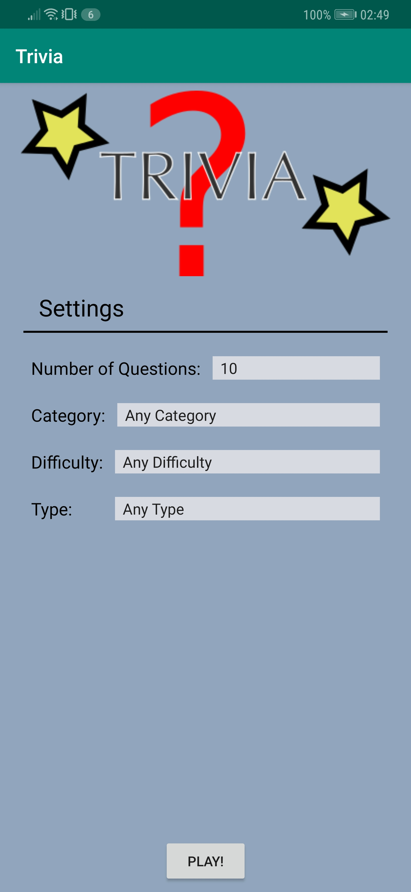
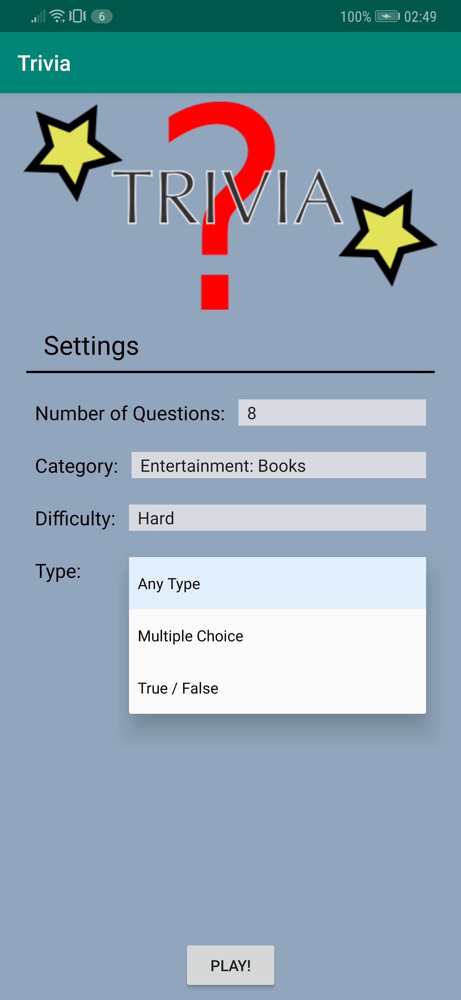
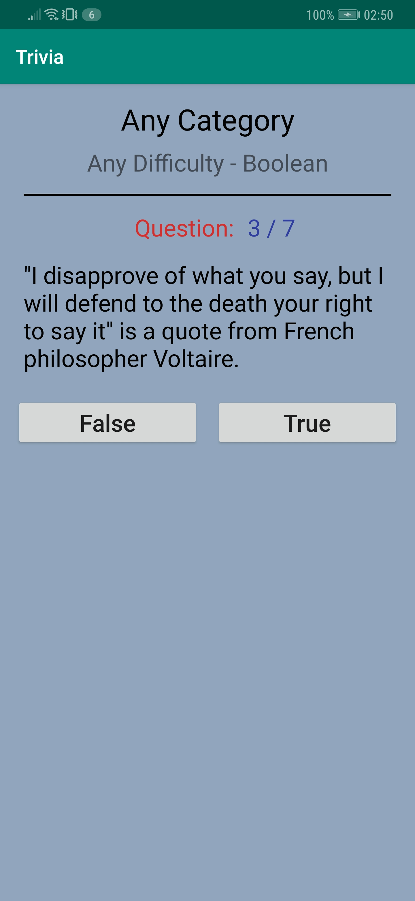
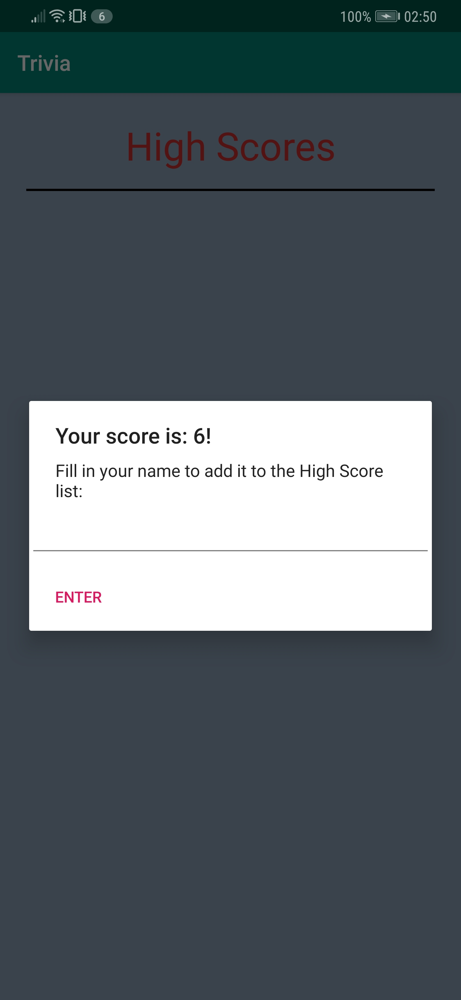
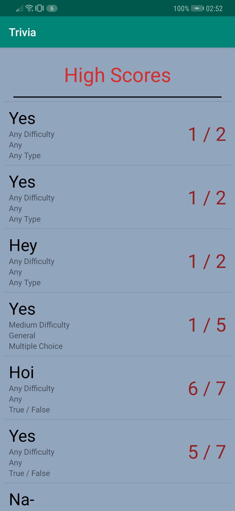

# Trivia
A short description of the app Trivia.

## Getting Started
### Prerequisites
The app is created in Android-Studio, it is currently made for API 24 Nougat (Android 7.0), but also confirmed running on API 28 Pie (Android 9.0).
An android phone with either one of those Android versions (and most likely the versions in between) will suffice.

## Test
When launching the app, a screen appears showing the start screen of the app. Here the user can adjust the settings of the trivia app by tapping on them, which will open a drop down window in which they can select a setting. When the user wants to start the game, the "PLAY!" button has to be clicked.

 

After the "PLAY!" button is clicked, the game will load in trivia's from the Open Trivia Database accordingly to the required settings. Here the user plays the game through answering the questions by clicking on the button they think is the correct answer to the question. When an answer has been clicked, the app will load in the next question, until all questions have been answered.

After all questions have been answered the app will load in the next screen and give a prompt for the user to fill in their name in order to add their score to an online highscore database. Once the user has clicked on "ENTER" the list of highscores will be displayed. If the user did not specify a name, the default player name of "AAA" will be used.

 

## Author
* Me

## Acknowledgements
* Renske Talsma
* Natasja Wezel
